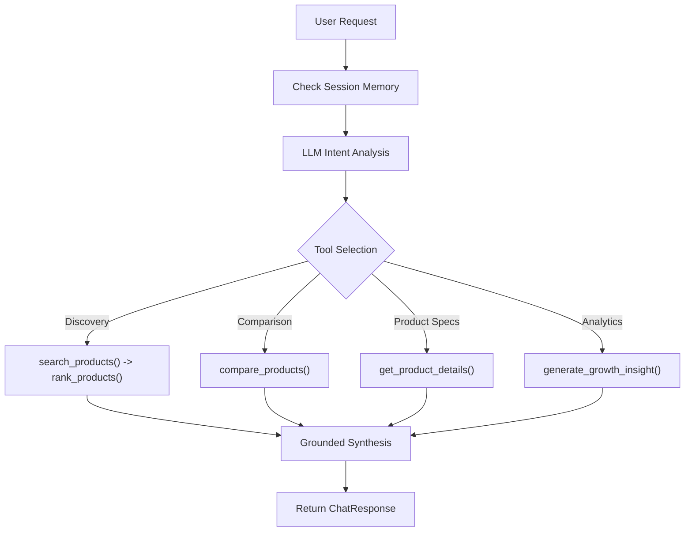

# Agentic Workflow & Tool Calling State Machine — ShopPilot AI

## 1. Agent Design Principles
ShopPilot AI is a goal-oriented autonomous agent. Rather than treating an LLM as an answer generator, the LLM functions as a **reasoner and tool dispatcher**.

## 2. Tool Inventory
1. `search_products(category, min_price, max_price, brands, min_rating, required_features, top_n)`
2. `filter_products(products, constraints)`
3. `rank_products(products, requirements, weights)`
4. `get_product_details(product_id)`
5. `compare_products(product_ids)`
6. `generate_growth_insight(metric_type)`

## 3. Tool Calling Workflow

